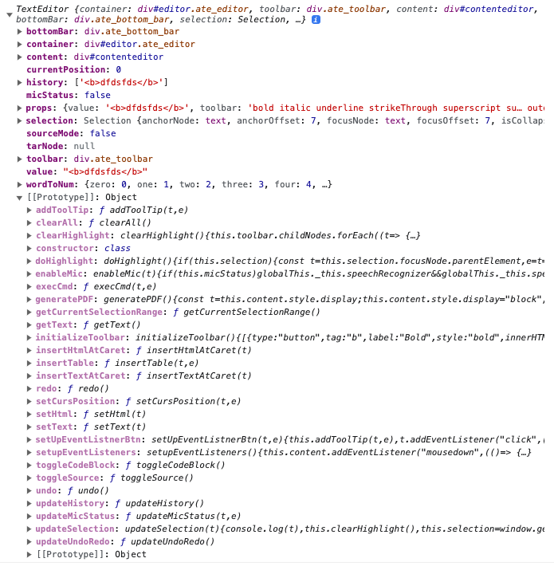

# Advanced Texteditor
    It has basic text editing tools and speech to text feature. [Demo](index.html)

# Examples:

## Pure js:

```
<!DOCTYPE html>
<html>
<head>
    <link rel="stylesheet" href="https://unpkg.com/advanced_texteditor/index.css" />
    <script type="text/javascript" src="https://unpkg.com/advanced_texteditor/dist/index.js"></script>
</head>
<body>
    <h1>Text Editor</h1>
    <div id="editor"></div>
</body>
<script>
    new Advanced.TextEditor("#editor", { toolbar: "bold italic underline strikeThrough superscript subscript formatBlock justifyLeft justifyCenter justifyRight justifyFull insertOrderedList insertUnorderedList insertHorizontalRule html pre indent outdent createLink unlink refresh undoRedo clear", value: "<b>hello world</b>", onChange: (e,value) => { console.log(value) } })
</script>

</html>
```

## React Js:

### Class Component

```
import { TextEditor } from "advanced_texteditor";
import "advanced_texteditor/index.css";

class Sample extends React.Component {
    constructor(props) {
       this.editoRef = null;
    }

    componentDidMount = () => {
       this.editoRef = new TextEditor("#editor", {
        toolbar: "bold italic underline strikeThrough superscript subscript formatBlock justifyLeft justifyCenter justifyRight justifyFull insertOrderedList insertUnorderedList insertHorizontalRule html pre indent outdent createLink unlink refresh undoRedo clear",
        value: "<b>hello world</b>",
          onChange: (e,value) => {
            console.log(value);
          },
       }),
    }

    render = () => {
       return(
        <div id="editor"/>
       )
    }
}
```
### Functional Component

```
import React, { useRef, useEffect } from 'react';
import { TextEditor } from "advanced_texteditor";
import "advanced_texteditor/index.css";

const Sample = () => {
    const editoRef = useRef(null);

    useEffect(() => {
       editoRef.current = new TextEditor("#editor", {
        toolbar: "bold italic underline strikeThrough superscript subscript formatBlock justifyLeft justifyCenter justifyRight justifyFull insertOrderedList insertUnorderedList insertHorizontalRule html pre indent outdent createLink unlink refresh undoRedo clear",
        value: "<b>hello world</b>",
          onChange: (e,value) => {
            console.log(e,value);
          },
       }),
    }, []);

    return (
      <div id="editor"/>
    );
}
```

### Custom Styles
Create index.css file, import this file and update css like below
```
.ate_editor [contenteditable] {
   // add here
}

.ate_editor .ate_toolbar,
.ate_editor .ate_bottom_bar {
   // add here
}

.ate_editor .ate_toolbar button,
.ate_editor .ate_bottom_bar button {
   // add here
}

.ate_editor .ate_toolbar button .tooltiptext,
.ate_editor .ate_bottom_bar button .tooltiptext {
   // add here
}

.ate_editor .ate_bottom_bar {
   // add here
}

// add here

```
### Ref Instance
